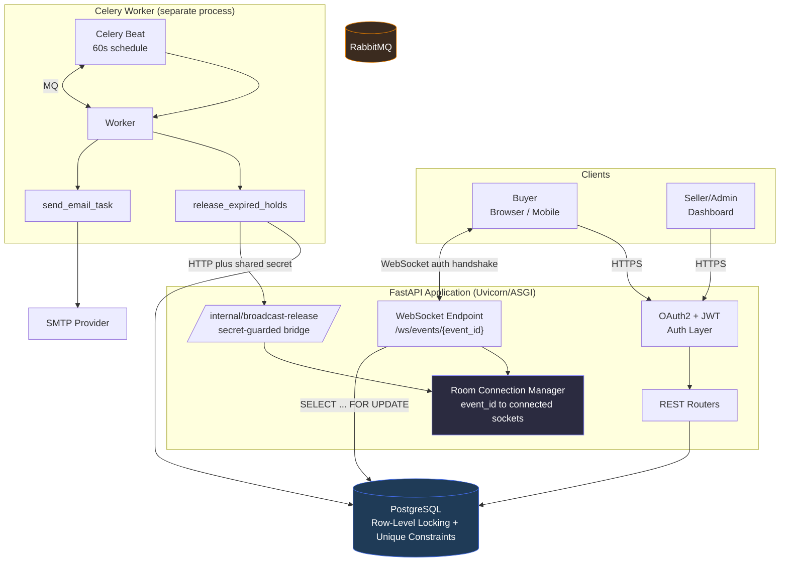
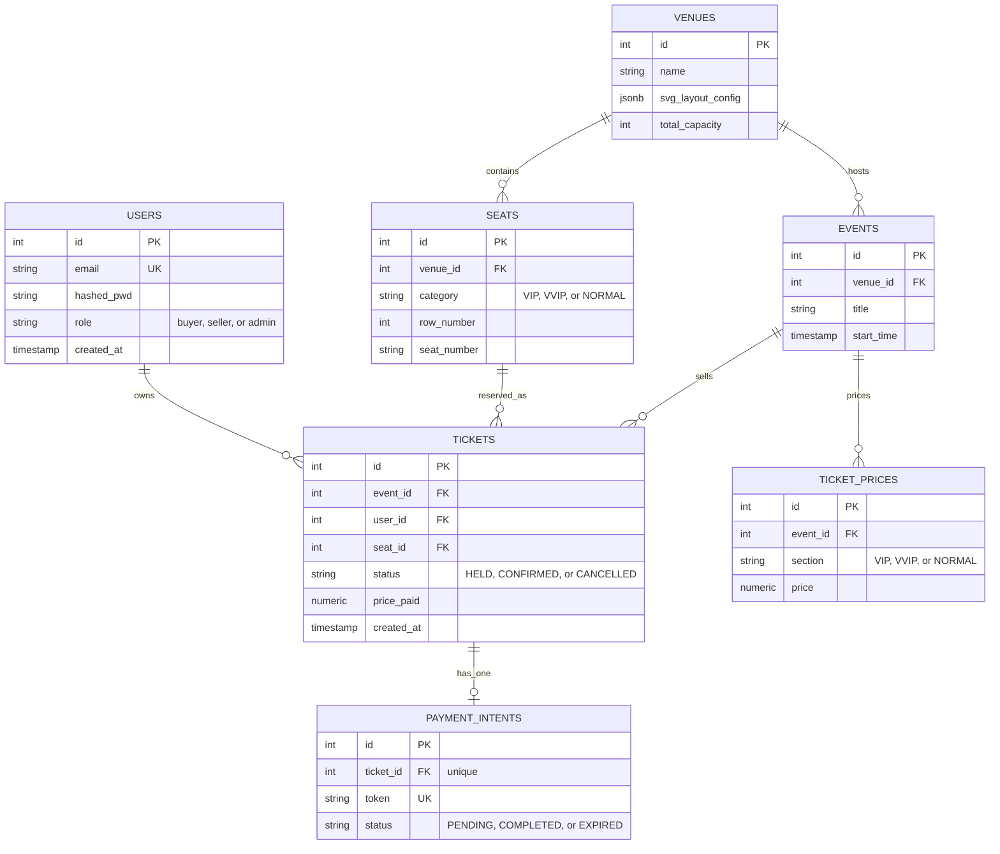
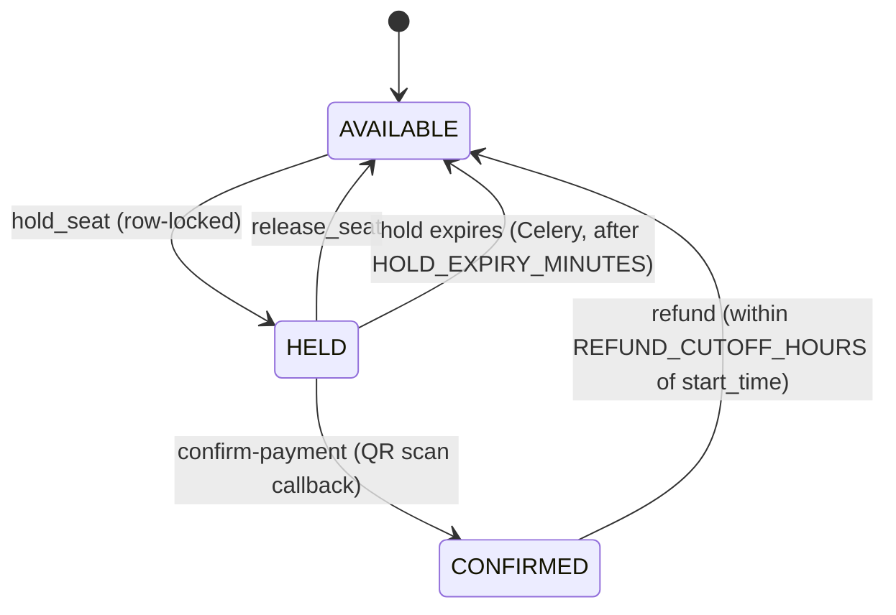

# 🎟️ Real-Time High-Concurrency Event Ticketing & Seat Reservation Engine


A backend engine for selling tickets to real events without ever double-booking a seat — proven under 50+ simultaneous buyers racing the same seat, not just assumed correct. It pairs a REST API with a stateful, room-based WebSocket layer, backs every reservation with real PostgreSQL row-level locking, and ships with a versioned migration history so it deploys cleanly to a managed database like Supabase.

> [!NOTE]
> Every guarantee documented below — the race-condition fix, the price-tampering fix, the venue-boundary fix, the event-loop-blocking fix — was a **real bug found by the test suite during development**, not a hypothetical scenario written for this README. Sections 5 and 6 show the actual before/after.

---

## 1. Overview

**FastAPI** exposes a REST surface for auth, venues, events, pricing, orders, and admin analytics, and a single WebSocket endpoint (`/ws/events/{event_id}`) that runs the real-time seat-locking engine. **PostgreSQL** is the single source of truth for seat state, accessed through **SQLAlchemy's synchronous ORM** — a deliberate choice explained in §5 — with schema evolution managed by **Alembic**, so the same codebase can be pointed at a fresh **Supabase** Postgres instance and brought up to date with one command, no manual DDL required. Background work (hold expiry, transactional email) runs on **Celery + RabbitMQ**, decoupled from the request/response cycle entirely.

---

## 2. Architecture & Data Flow



### Request/Data Lifecycle

1. **Request parsing** — FastAPI + Pydantic v2 validate every inbound payload against strict schemas (`Literal` enums for `role`, `category`, `status` — no free-text drift into the database).
2. **OAuth2 JWT auth** — `POST /login` issues a JWT (`python-jose`) embedding `user_id` and `role`; every protected route resolves it via `oauth2.get_current_user`, or a `RequireRole` wrapper for role-gated endpoints (`buyer` / `seller` / `admin`).
3. **Atomic DB lock** — the WebSocket's `hold_seat` handler takes a `SELECT ... FOR UPDATE` row lock before mutating a seat's ticket row (full mechanics in §5).
4. **Event broadcast** — a successful state change is pushed to every socket subscribed to that event's room, so every open seat map updates instantly.

### Race Condition Sequence — 50 Buyers, 1 Seat

```mermaid
sequenceDiagram
    participant W as Winner (Client 1)
    participant L as Losers (Clients 2-50)
    participant WS as WebSocket Handler
    participant DB as PostgreSQL

    par 50 concurrent requests hit the server within the same millisecond
        W->>WS: hold_seat(seat_id=4)
        L->>WS: hold_seat(seat_id=4) x49
    end

    WS->>DB: SELECT ticket WHERE (event_id, seat_id) FOR UPDATE
    Note over DB: Only ONE transaction acquires the row lock first;<br/>every other transaction BLOCKS here until it commits/rolls back
    DB-->>WS: no existing row (seat never held before)
    WS->>DB: INSERT ticket (status=HELD), protected by UNIQUE(event_id, seat_id)
    DB-->>WS: commit succeeds

    WS-->>W: broadcast SEAT_HELD (seat_id=4, ticket_id=16, held_by_user_id=W)
    WS-->>L: broadcast SEAT_HELD (seat_id=4, ticket_id=16, held_by_user_id=W)
    Note over L: filters held_by_user_id != my own id, recognizes it's NOT their win

    loop the other 49 transactions, now unblocked
        WS->>DB: SELECT ... FOR UPDATE (was blocked, now proceeds)
        DB-->>WS: row exists, status = HELD
        WS-->>L: ERROR "Seat 4 is already occupied or locked."
    end
```

---

## 3. Entity-Relationship Diagram



### Constraints doing the real work

| Constraint | Table | Purpose |
|---|---|---|
| `uq_event_seat_ticket (event_id, seat_id)` | `tickets` | Unconditional DB-level backstop against double-booking |
| `uq_venue_seat (venue_id, category, row_number, seat_number)` | `seats` | No two identical seat coordinates in one venue |
| `uq_event_section_price (event_id, section)` | `ticket_prices` | Exactly one price per category per event |
| `payment_intents.ticket_id` unique | `payment_intents` | One active payment session per ticket |

---

## 4. Core API & Real-Time Feature Matrix

### 🔐 User Auth & Management
| Method | Path | Auth | Description |
|---|---|---|---|
| POST | `/signup` | none | Create a user (`buyer`, `seller`, or `admin`) |
| POST | `/login` | none | Exchange credentials for a JWT |

### 🏟️ Event & Venue Discovery + Management
| Method | Path | Auth | Description |
|---|---|---|---|
| GET | `/venues/` | public | List all venues |
| GET | `/venues/{id}` | public | Get one venue |
| GET | `/venues/{venue_id}/seats` | public | Static seat list for a venue |
| GET | `/events/` | public | List events |
| GET | `/events/{id}` | public | Get one event |
| GET | `/events/{id}/layout` | public | Venue SVG config + ticket prices (static structure) |
| GET | `/events/{event_id}/seats` | public, optional auth | Live seat map: status, price, and (if authenticated) your own `is_mine`/`ticket_id` |
| POST | `/venues/` | seller/admin | Create a venue |
| PUT | `/venues/{id}` | seller/admin | Update a venue |
| POST | `/venues/{venue_id}/seats` and `/seats/bulk` | seller/admin | Create one seat, or many atomically (capped at `total_capacity`) |
| POST | `/events/` | seller/admin | Create an event under an existing venue |
| PUT | `/events/{id}` | seller/admin | Update an event |
| POST | `/events/{event_id}/prices` | seller/admin | Set a price for a section |
| PUT | `/events/prices/{price_id}` | seller/admin | Update a price |

### ⚡ Real-Time Seat Reservation Engine (WebSocket)
| Channel/Action | Description |
|---|---|
| `ws://.../ws/events/{event_id}` | Connect, then send `{"action":"auth","token":"<jwt>"}` as your first message |
| `hold_seat` | Row-locked, venue-validated, server-priced seat hold — see §5 |
| `release_seat` | Owner/admin releases a `HELD` seat back to `AVAILABLE` |

### 🎫 Ticket Issuance
| Method | Path | Auth | Description |
|---|---|---|---|
| POST | `/orders/checkout` | owner/admin | Generates a QR + payment token for a `HELD` ticket (does not confirm yet) |
| GET | `/orders/confirm-payment/{token}` | public | The QR's target URL — mock payment gateway callback, flips ticket `CONFIRMED` |
| GET | `/orders/` | any logged-in user | Your tickets (admins see all) |
| GET | `/orders/{id}` | owner/admin | One ticket |
| DELETE | `/orders/{id}/cancel` | owner/admin | Refund a `CONFIRMED` ticket, only within `REFUND_CUTOFF_HOURS` of the event |

### 📊 Admin & Internal
| Method | Path | Auth | Description |
|---|---|---|---|
| GET | `/admin/dashboard` | admin only | Total revenue, tickets sold, active holds, per-event breakdown |
| POST | `/internal/broadcast-release/{event_id}` | shared secret header | Celery-only: pushes live updates after an auto-expiry |

---

## 5. Concurrency & Race Condition Mechanics — Deep Dive

### Seat lifecycle state machine



### Layer 1 — Pessimistic row lock (the common case: a seat that was touched before)

```python
existing_ticket = (
    db.query(models.Ticket)
    .filter(models.Ticket.event_id == event_id, models.Ticket.seat_id == seat_id)
    .with_for_update()          # real DB row lock for the rest of this transaction
    .first()
)
```
Whichever concurrent transaction reaches this line first holds the lock; every other one **blocks** until the first commits or rolls back, then sees the post-write state — never a stale snapshot.

### Layer 2 — Unique constraint (the edge case a lock can't cover: a seat that's never been touched, so there's no row yet to lock)

```python
__table_args__ = (
    UniqueConstraint("event_id", "seat_id", name="uq_event_seat_ticket"),
)
```
Two brand-new `INSERT`s can still race each other; Postgres rejects the second with an `IntegrityError`, caught and turned into a clean rejection instead of a crash or silent duplicate.

### Boundary & integrity validations

| Exploit found in testing | Fix |
|---|---|
| Client sent an arbitrary `price_paid`, including near-zero | Price is always looked up server-side from `Ticket_Price`, matched on the seat's `category` — client-supplied price is accepted for backward compatibility but never trusted |
| Client passed a `seat_id` belonging to a different venue than the event's own venue, bypassing capacity limits | `hold_seat` now checks `seat.venue_id == event.venue_id` before any lock is even attempted |

### Why sync SQLAlchemy, not an async engine

The ORM layer is deliberately **synchronous** (`sqlalchemy.orm.Session`, not `AsyncSession`) — simpler transaction semantics for `with_for_update()` locking, and a mature, predictable path. The tradeoff: a blocking DB or bcrypt call inside an `async def` route freezes FastAPI's *entire* event loop for every other in-flight request, not just the one waiting. This was caught directly by load testing (see §6) — every route that does no genuine `await` is declared as a plain `def`, which FastAPI runs in a worker thread pool automatically, so blocking work never stalls unrelated requests. Routes that truly await something (`await manager.broadcast_to_event(...)`) correctly stay `async def`.

---

## 6. Testing & Quality Assurance

### Tier 1 — pytest (unit & integration)
Runs against a dedicated Postgres test database, wired up by loading `.env.test` before any app module is imported. Celery runs in eager mode (no RabbitMQ needed for tests), `smtplib.SMTP` is mocked globally, and tables are truncated after every test for isolation.

```
tests/
├── conftest.py          # DB wiring, Celery eager mode, SMTP mock, auth + seed fixtures
├── test_auth.py         # signup/login, role validation
├── test_events.py       # listing, layout, seat map, seller/admin permissions
├── test_websocket.py    # auth handshake, hold_seat, release_seat, ownership checks
├── test_orders.py       # checkout -> confirm-payment -> refund lifecycle
├── test_internal.py     # shared-secret guard on the broadcast bridge
├── test_admin.py        # revenue/ticket-count aggregation, seeded to exact values
└── test_celery_tasks.py # hold expiry job, email side effects, sold-out notification
```

### Tier 2 — test_ws_concurrency.py (real-time race-condition verification)
An async script using the `websockets` library against a live running server — real database, real row locks, no mocking. Each of 50 simulated clients uses its own distinct account (so `held_by_user_id` unambiguously identifies the actual winner), all fire `hold_seat` on the same seat through an `asyncio.Event` barrier, and the script cross-checks that only one distinct `ticket_id` exists across every response — the real proof against double-booking, not just a message count.

```
TEST 1: Race condition - 50 users fighting over seat_id=4...
Releasing barrier - all clients fire 'hold_seat' simultaneously...
Elapsed: 0.16s | SEAT_HELD: 1 | ERROR: 49 | exceptions: 0
PASS: exactly one client secured the seat; the rest were correctly rejected.
   Winning broadcast payload: seat_id=4, ticket_id=16

TEST 2: Capacity/venue enforcement - 1 real seat(s) + 1 foreign seat...
Real seats held successfully: 1 / 1
PASS: every legitimate seat in this venue could be held.
Foreign seat (id=8) response: ERROR - "Seat 8 does not belong to this event's venue."
PASS: a seat from a different venue was correctly rejected.
```

### Tier 3 — locustfile.py (sustained load testing)
Weighted `HttpUser` classes simulating realistic traffic: mostly buyers browsing, fewer sellers writing (venue to seats to event to price, chained), occasional admin dashboard checks.

> [!IMPORTANT]
> **A real bug this caught:** early runs showed `/login` and `/signup` at **12-24 second** p50 latency. Root cause: `async def` routes calling blocking `bcrypt` directly on the event loop, stalling every in-flight request. Fixed per §5 — dropped to roughly 250-700ms p50 under the same load.

```
Type     Name                     50%    90%    95%    99%   # reqs
GET      /events/{id}/seats       610   1100   1400   1600     333
POST     /login                   470    780   1100   1600     100
GET      /admin/dashboard         680   1100   1200   1400     106
Aggregated                        580   1200   1600   3200    2290
```

---

## 7. Local Development & Setup Guide

### 1. Clone & environment
```bash
git clone <your-repo-url>
cd project_2
python -m venv .venv
source .venv/bin/activate
# Windows: .venv\Scripts\activate
pip install -r requirements.txt
```

### 2. Configure .env
Copy `.env.example` to `.env` and fill in the values from §8.

### 3. Database - Alembic migrations
Schema is versioned with Alembic, so the same migration history applies whether you're running a local Postgres instance or a managed one like **Supabase** (which is exactly what makes a free-tier **Render + Supabase** deployment straightforward — no manual DDL against a database you don't have shell access to).

```bash
# Apply every migration up to the latest
alembic upgrade head
```

After changing a model in app/models.py:
```bash
alembic revision --autogenerate -m "describe your change"
alembic upgrade head
```

> [!NOTE]
> Point `DATABASE_URL` at your Supabase connection string (Settings -> Database -> Connection string, using the pooler URL for serverless/Render deployments) before running migrations against it.

### 4. Run the stack
```bash
# Terminal 1 - the API
uvicorn app.main:app --reload

# Terminal 2 - background worker (auto-expiry, emails)
celery -A app.celeryapp worker --loglevel=info --pool=solo
# --pool=solo needed on Windows

# Terminal 3 - scheduler that triggers the expiry job every 60s
celery -A app.celeryapp beat --loglevel=info
```
RabbitMQ must be reachable (locally via `docker run -d -p 5672:5672 rabbitmq:3-management`, or a managed broker like CloudAMQP for deployment).

### 5. Run the test suites
```bash
pytest -v
python test_ws_concurrency.py
locust -f locustfile.py --host http://127.0.0.1:8000
```

---

## 8. Environment Variables Reference

| Variable | Required | Description |
|---|---|---|
| `DATABASE_URL` | Yes | Postgres connection string (local, or your Supabase pooler URL) |
| `SECRET_KEY` | Yes | JWT signing secret — also reused as the `/internal/*` shared secret |
| `ALGORITHM` | Yes | JWT signing algorithm, e.g. `HS256` |
| `ACCESS_TOKEN_EXPIRE_MINUTES` | Yes | JWT lifetime |
| `BROKER_URL` | Yes | RabbitMQ connection string for Celery |
| `HOLD_EXPIRY_MINUTES` | Yes | How long a `HELD` seat survives before Celery auto-releases it |
| `REFUND_CUTOFF_HOURS` | Yes | How close to `event.start_time` a refund is still allowed |
| `FASTAPI_INTERNAL_URL` | Yes | Where the Celery worker reaches this FastAPI process |
| `SMTP_HOST` / `SMTP_PORT` / `SMTP_USER` / `SMTP_PASSWORD` | Yes | Transactional email provider (Mailtrap for dev) |
| `FROM_EMAIL` | Yes | Sender address for all outgoing email |
| `SUPABASE_DB_URL` | Optional | Alternate explicit Supabase connection string, if not using `DATABASE_URL` directly |

---

## Roadmap / Known Next Steps

- [ ] Move the WebSocket to Celery bridge (`/internal/broadcast-release`) to Redis pub/sub for horizontal scaling beyond a single FastAPI process
- [ ] Replace the raw shared-secret header on `/internal/*` with a network-level restriction for production
- [ ] Real payment gateway integration behind the existing QR/`PaymentIntent` abstraction (currently a mock "scan to confirm" flow)
- [ ] CI check that fails if `alembic revision --autogenerate` would produce a non-empty diff against committed models

---

<p align="center">Built and hardened through real concurrency testing, not assumed correct.</p>
